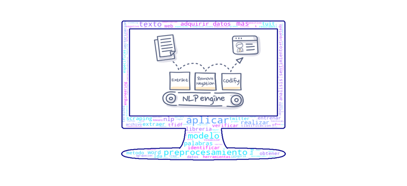

# PORTAFOLIO NLP

Soy Sandra Karina Osorio Chaparro, Comunicadora Social - Periodista de la Universidad Jorge Tadeo Lozano, trabajo cono Líder de Operaciones del Área de Censos de Servinformación, me encanta el mundo de los datos y especialmente de la visualización de los mismos, ya que considero que la información procesada y analizada permite generar valor, el transmitir una idea de forma clara y con elementos gráficos adecuados da poder de decisión a quien la posee.

En este Portafolio podrás ver los conocimientos adquiridos que obtuve a través del avance de las clases de Procesamiento de Lenguaje Natural – NLP durante el segundo semestre de mi especialización de Analítica Estratégica de Datos.

Gracias a la profe Viviana Peña que con su excelente pedagogía hizo que viéramos que el NLP es un mundo sorprendente y amplio y que lo único que se requiere es querer aprender, apasionarse con lo que se hace y por supuesto … **¡Saber buscar en Google¡**

[**Adquisición de textos** 📌](https://github.com/SandraKOsorio/PORTAFOLIO-2021_NLP/blob/main/Taller_Adquisici%C3%B3n_Textos.ipynb)

- [x] Descomprimir y leer archivos .zip
- [x] Identificar archivo con mayor número de palabras

[**Web Scraping** 📌](https://github.com/SandraKOsorio/PORTAFOLIO-2021_NLP/blob/main/Taller%203_Web_Scraping.ipynb)

- [x] Realizar Web Scraping para obtener títulos y negrillas
- [x] Reemplazar todos los caracteres especiales con la librería Regex

[**Pre-Procesamiento Textos y Featuring Engineering** 📌](https://github.com/SandraKOsorio/PORTAFOLIO-2021_NLP/blob/main/Taller%204_Pre-Procesamiento%20Textos%20y%20Featuring%20Engineering.ipynb)

- [x] Aplicar herramientas específicas de pre-procesamiento
  * Tokenización
  * Stemming 
  * Lematización
  * Etiquetado gramatical
- [x] Aplicar métodos de vectorización Bag of Words con sklearn 
- [x] Conteo de vocabulario
- [x] Conocer la diferencia para aplicar n-gramas o BoW

[**TF-IDF** 📌](https://github.com/SandraKOsorio/PORTAFOLIO-2021_NLP/blob/main/Taller%205_TF-IDF.ipynb)

- [x] Aplicar herramientas específicas de pre-procesamiento 
- [x] Aplicar métodos de vectorización TF-IDF
- [x] Verificar medidas de similitud
  * Distancia del Coseno
  * Identificar datos más similares
  * Identificar datos más distantes
      
[**Clasificación de Textos** 📌](https://github.com/SandraKOsorio/PORTAFOLIO-2021_NLP/blob/main/Taller%207_Clasificaci%C3%B3n%20de%20Textos.ipynb)

- [x] Adquirir datos etiquetados
- [x] Aplicar Feature Engineering (Pre-procesamiento, TF-IDF, etc.)
- [x] Entrenar Modelos de Clasificación para NLP 
  * Regresión logística
  * Bayesiano ingenuo (Naive Bayes)
  * Máquinas de vectores de soporte (SVM)
  * Árboles de decisión
- [x] Aplicar métricas de evaluación 
  * Precisión
  * Recall
  * F1-score
  * Accuracy 
- [x] Realizar matriz de confusión
- [x] Poner en producción el Modelo
- [x] Extraer términos más importantes por categoría
- [x] Extraer los términos que contribuyen más a cada categoría

[**Agrupación de Textos con K-Means** 📌](https://github.com/SandraKOsorio/PORTAFOLIO-2021_NLP/blob/main/Taller%208_%20Agrupaci%C3%B3n%20de%20textos.ipynb)

- [x] Adquirir datos
- [x] Aplicar Pre-procesamiento
- [x] Aplicar método del codo para determinar K
- [x] Entrenar modelo con el K escogido
- [x] Interpretar de los clústeres
- [x] Visualizar usando PCA
- [x] Predecir con el Modelo

[**Modelado de Temas** 📌](https://github.com/SandraKOsorio/PORTAFOLIO-2021_NLP/blob/main/Taller%209_Modelado%20de%20Temas.ipynb)

- [x] Adquirir datos
- [x] Aplicar Pre-procesamiento
- [x] Aplicar Modelo de LDA 
- [x] Crear una representación de los documentos en diccionario
- [x] Filtrar palabras muy frecuentes o infrecuentes 
  * Crear el Corpus
  * Entrenar el modelo
  * Visualizar de LDA
- [x] Verificar resultados obtenidos

[**Visualizaciones para NLP** 📌](https://github.com/SandraKOsorio/PORTAFOLIO-2021_NLP/blob/main/Taller%2010_Nube%20de%20palabras.ipynb)

- [x] Adquirir datos
- [x] Aplicar Pre-procesamiento
- [x] Realizar nube de palabras en Python

[**Redes Sociales y NLP** 📌](https://github.com/SandraKOsorio/PORTAFOLIO-2021_NLP/blob/main/Taller%2011_Twitter.ipynb)

- [x] Adquirir tuits a través de la API de Twitter
- [x] Realizar Scraping Twitter con la librería SNScrape
- [x] Aplicar Pre-procesamiento en Twitter (Eliminar links, hashtags y mentions)
- [x] Realizar una visualización con series de tiempo

[**Análisis de Sentimiento** 📌](https://github.com/SandraKOsorio/PORTAFOLIO-2021_NLP/blob/main/Taller_12_An%C3%A1lisis_de_Sentimientos.ipynb)

- [x] Adquirir datos
- [x] Aplicar Pre-procesamiento
- [x] Análisis de Sentimiento con librería Flair 
  * Obtener resultados obtenidos
  * Obtener total tuits positivos y negativos 
  * Extraer tuit más positivo
  * Extraer tuit más negativo
       
# [**Proyecto Final** 🏅](https://github.com/SandraKOsorio/PORTAFOLIO-2021_NLP/blob/main/Proyecto_Final_NLP.ipynb)

- [x] El objeto era revisar las letras de las rondas infantiles utilizado algunos técnicas y modelos vistos en clase, para verificar si son capaces de detectar las palabras    con connotación agresivas, violentas y machistas. 
- [x] Las técnicas y modelos aplicados fueron:
  * Web Scraping
  * Pre-procesamiento
  * Bag of Words
  * Modelo Word2Vec (Word to Vac)
  * Agrupación de Textos con K-Means – Clustering
  * Modelo de LDA
  * Análisis de sentimiento

**_"Hay tres tipos de personas en el mundo: los que hacen que las cosas ocurran, los que ven cómo ocurren las cosas y los que se preguntan qué ocurrió"_ 
N. Butler.**
